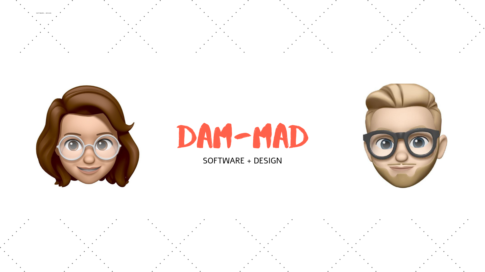

  

<h1 align="center">
 DAMMAD.io
</h1>

Making DAM good software with MAD design.

## START

If you'd like to clone this simple site, `fork` and `clone` this repo. Then run `npm run dev`.

## BUILD

This app is built with `React.js` utilizing `Gatsby.js`. When ready to build, run `npm run build`.
